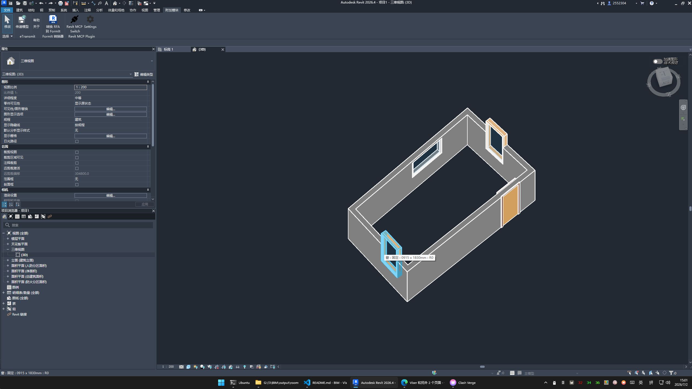
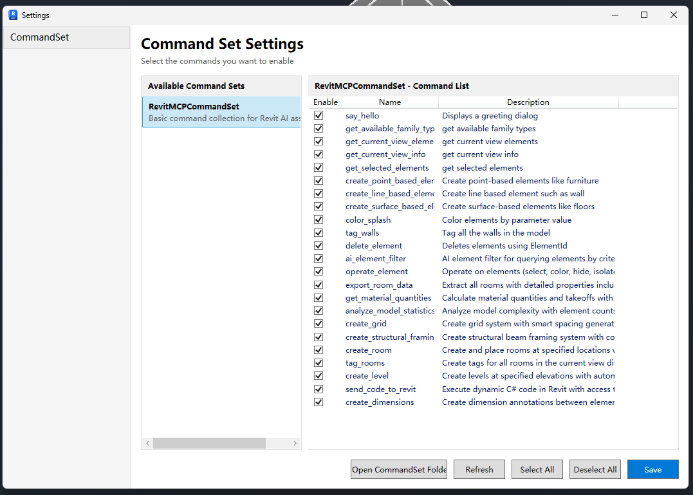
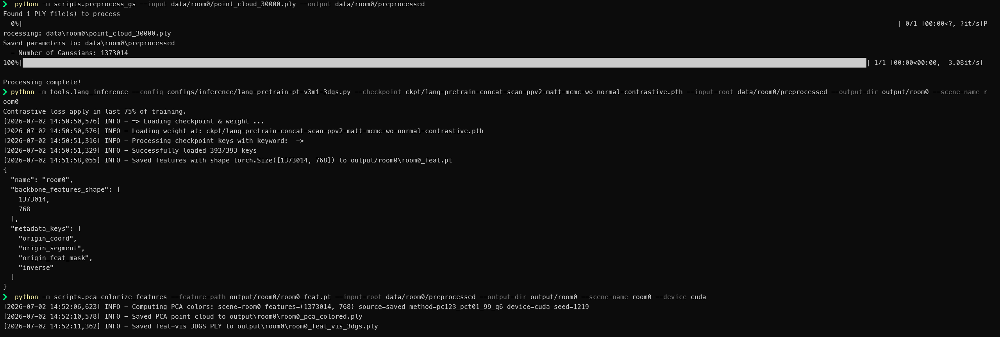
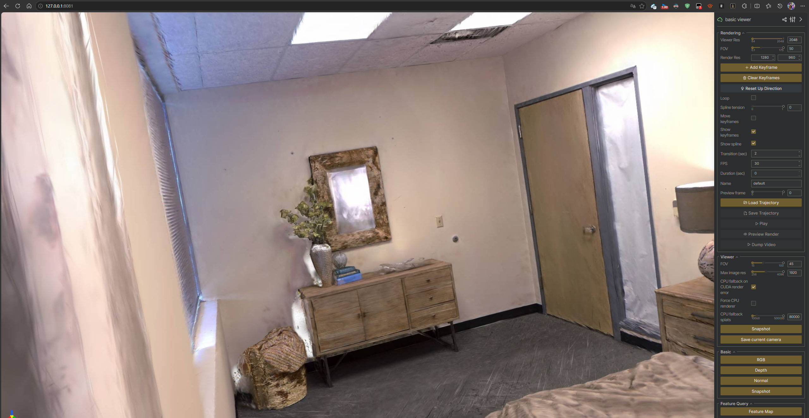
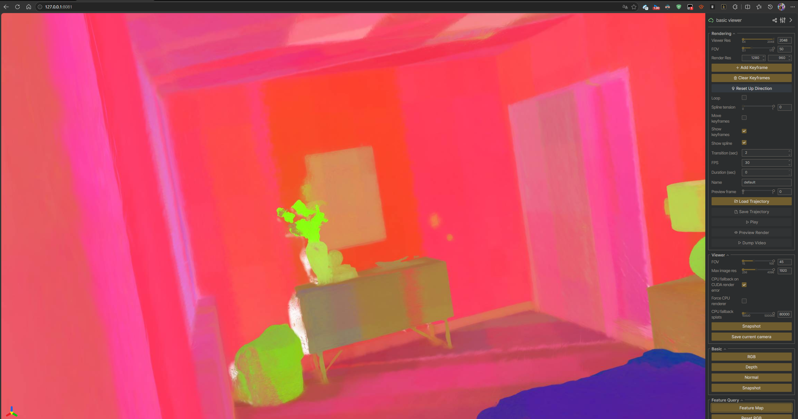
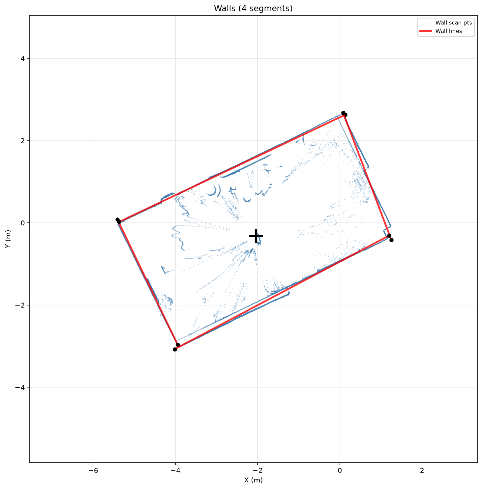
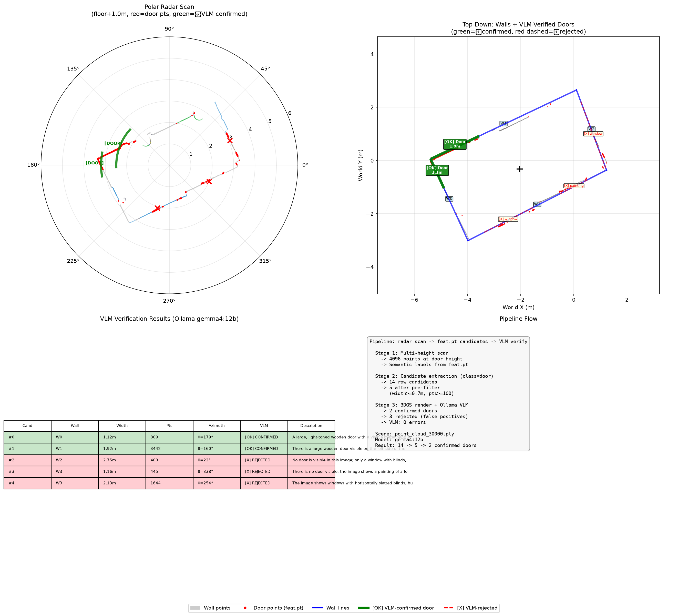
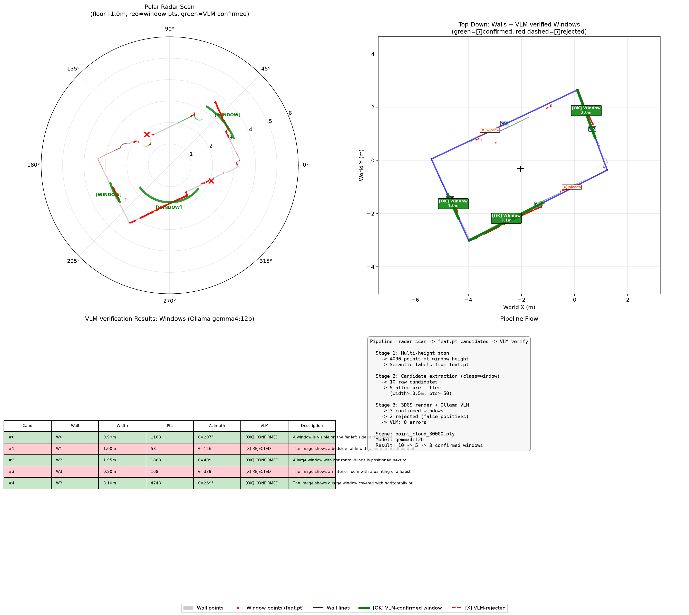

# 3DGS → BIM 自动重建系统

从消费级手机视频/RGB-D 数据，通过 3D Gaussian Splatting + SceneSplat 语义特征 + 虚拟激光扫描，自动提取墙体几何并导入 Revit。

## 系统架构

```
手机视频 → COLMAP → nerfstudio 3DGS训练 → gsplat场景
                                                  │
                                    SceneSplat PT-v3 推理 → feat.pt
                                                  │
                           ┌──────────────────────┼──────────────────────┐
                           ▼                      ▼                      ▼
                    虚拟激光扫描            语义高斯查询            底图引导拟合
                 (virtual_scanner)       (query_semantics)      (fit_walls_guided)
                           │                      │                      │
                           ▼                      ▼                      ▼
                    墙线提取管线            WallFitter RANSAC       FloorPlanGuidedFitter
                 (wall_line_extractor)     (盲拟合，无底图)         (走廊+直方图峰值)
                           │                      │                      │
                           └──────────┬───────────┴──────────┬───────────┘
                                      ▼                      ▼
                              wall_lines.json          Revit MCP 工具
                              wall_lines_topdown.png   create_line_based_element
```

## 已实现功能

### P0：基础设施
- **FloorPlan 契约**（`bim_recon/floorplan.py`）：WallSegment、Opening、ManualProvider，支持 JSON 输入和矩形房间快速生成。
- **Revit C# 代码生成**（`bim_recon/revit_code.py`）：FloorPlan → Revit API C#（墙、板、门窗洞口）。

- **差异报告**（`bim_recon/diff_report.py`）：底图墙线 vs 检测墙线的匹配与差异输出。

### P1：3DGS + 语义
- **GSScene**（`bim_recon/gs_scene.py`）：为Windows平台做了适配能加载 PLY / SceneSplat .npy 场景，gsplat 渲染（RGB+ED），语义查询。支持 `from_npy()` 加载 post-activation 格式数据。

- **SemanticQuerier**（`bim_recon/semantics.py`）：加载 SceneSplat `feat.pt` + SigLIP2 文本嵌入，三种查询模式（dominant/threshold/top_percent）。9 类 BIM 词表（wall/floor/ceiling/door/window/column/beam/stairs/furniture）。


- **MCP Server**（`bim_recon/mcp_gs.py`）：**9 个工具**暴露 3DGS 场景给 VLM/Agent——get_scene_info、list_cameras、render_from_pose、get_depth_grid、select_cluster、query_semantics、render_semantic_overlay、fit_walls、fit_walls_guided。
- **COLMAP + 训练包装**（`bim_recon/colmap_runner.py`、`scripts/train_gs.py`）：包装 nerfstudio 命令。

### P2：墙体重建

- **WallFitter**（`bim_recon/wall_fitter.py`）：迭代 RANSAC + 遮挡补全合并 + 重力对齐 + 端点精修 + 高度提取。无底图盲拟合。
- **FloorPlanGuidedFitter**（`bim_recon/wall_fitter.py`）：走廊筛选 + 固定法向直方图峰值拟合。需用户提供底图 JSON。
- **FloorPlan 自动配准**（`bim_recon/floorplan_registration.py`）：PCA 旋转 + 90° 候选搜索 + 平移网格搜索 + 地板多边形评分。
- **虚拟激光扫描器**（`bim_recon/virtual_scanner.py`）：从 3DGS 深度渲染模拟 2D 激光扫描，多视角拼接 360° 极坐标扫描，每个扫描点携带 feat.pt 语义标签。
- **栅格化墙线提取**（`bim_recon/wall_line_extractor.py`）：多高度扫描 → DBSCAN 去噪 → 栅格化 + 形态学闭运算 → 轮廓提取 → Douglas-Peucker → RANSAC/PCA 精修 → 闭合墙线多边形。

### P2.5：VLM 验证元素提取


- **候选提取器**（`bim_recon/candidate_extractor.py`）：从多高度扫描 + feat.pt 语义标签提取门/窗/家具候选位置。投影到墙线 + 间隙聚类 + 极坐标 (θ, r) 计算。支持结构构件（投影到墙）和自由构件（DBSCAN 聚类）。
- **VLM 验证器**（`bim_recon/vlm_verifier.py`）：极坐标→相机位姿映射 → 3DGS 渲染针对性图像 → Ollama gemma4:12b VLM 确认/排除。两阶段检测：feat.pt 高召回找候选，VLM 高精度做判定。支持 `vlm_hint` 提示词注入。
- **元素类型注册表**（`bim_recon/element_config.py`）：`ElementConfig` frozen dataclass（name/class_idx/structural/min_width/min_points/vlm_hint/height_detection），注册 door/window/column/furniture 四种类型。
- **端到端 CLI**（`scripts/run_pipeline.py`）：唯一入口——加载场景 → 12 高度雷达扫描 → 墙线提取 → 多类型元素检测（feat.pt 候选 → 预过滤 → Ollama VLM 验证 → **高度精修**）→ JSON 输出。

### P3：高度检测
- **高度检测器**（`bim_recon/height_detector.py`）：VLM 确认后，对墙挂构件（门/窗）做垂直深度探测，精修 sill/header 高度。两阶段扫描（粗扫 0.2m 间距 → 精扫 0.02m 迭代逼近），双信号判据（深度突变 + 语义匹配）。集成到 `run_pipeline.py`，对 `height_detection=True` 的构件类型自动启用。

### P3.5：Falcon-Perception 分割提取空间位置


- **深度探测的局限**：透明玻璃导致深度渲染穿过玻璃（深度突变信号失效）；feat.pt 语义标签垂直泄漏（语义匹配信号也不可靠）。room0 三扇窗 header 全部检测为天花板高度。
- **Falcon-Perception 分割**（`bim_recon/spatial_extractor.py`）：渲染垂直立面图 → Falcon-Perception 开放词表分割 → 紧致 mask bbox → 线性映射回墙局部坐标（sill/header/width）。垂直相机保证像素→米制映射无透视畸变。
- **HTTP 桥接**（`Falcon-Perception/falcon_inference_server.py` + `bim_recon/falcon_client.py`）：Falcon-Perception 需要 torch 2.11（transformerv 环境），gsplat 需要 torch 2.7（bim-recon 环境），两环境不可合并 → FastAPI HTTP 桥接。
- **Seg 遮罩叠加图**：Falcon 分割后，在立面渲染图上绘制检测结果（检测 bbox 绿框 + mask bbox 红框），保存为 `*_overlay.png` 供调试。
- **深度探测保留为 fallback**：Falcon server 不可达或无结果时自动回退到深度探测，pipeline 始终可用。
- **CLI 参数**：`--falcon-host`（默认 127.0.0.1）、`--falcon-port`（默认 18390）、`--no-falcon`（禁用 Falcon，仅用深度探测）。
- **时间戳输出**：每次运行创建 `output/<name>/YYYYMMDD_HHMMSS/` 目录，保存所有中间数据（雷达图、渲染图、叠加图、JSON）。

### P3.6：Revit MCP 工具扩展（自定义尺寸门窗）
- **问题**：Revit 门/窗宽高是**族类型参数**，不是实例参数。现有 MCP 工具创建的永远是默认尺寸。
- **解决方案**：扩展 `CreatePointElementEventHandler.cs`，事务内自动复制族类型 + 设置 `FAMILY_WIDTH_PARAM`/`FAMILY_HEIGHT_PARAM`，类型名 `Custom {W}x{H}mm`。
- **窗台高度**：通过 `parameters: {"sillHeight": N}`（mm）设置。
- **构建自动化**（`scripts/build_deploy_revit.ps1`）：一键构建 C# + TypeScript + 部署（5 步：Kill Revit → Build C# → Build TS → Deploy → Verify）。Debug 构建自动部署到 Addins。
- **本地开发**：opencode MCP 配置指向本地 `server/build/index.js`（非 npm 发布版），修改 TS server 后重启 opencode 即时生效。

### P3.7：Falcon 权威判定 + Gradio Web UI + 确定性 Workflows


#### Falcon 权威判定（消除假阳性）
- **问题**：Falcon 在线但未检测到构件时，回退到 depth-probe 产生假阳性（实际不存在的构件被"发现"）。
- **修复**：Falcon 在线 + 返回空 → **直接拒绝**（`falcon_rejected`），不再回退 depth-probe。Falcon 离线时仍保留 depth-probe fallback。

#### Gradio 单页 Web UI（`scripts/gradio_app.py`）
- **Gradio Web UI**：单页界面（场景准备 → 管线 → 检测结果 → 微调 → Revit 工作流 → B 类构件工作流 → 3D 查看器）
  - ① 场景与数据准备：PLY 上传 → 验证 → SceneSplat 预处理
  - ② 运行管线：确定性步骤事件实时输出 → 结果下拉列表；选择 `furniture` 可产生 B 类候选
  - ③ 检测结果：三行图库（雷达图 + VLM验证 + Seg叠加）+ JSON 报告
  - ④ 微调：Mask 绘制（`gr.ImageMask`）+ 视角重分割
  - ⑤ Revit 确定性工作流：按顺序创建标高、楼板、墙和门窗并核验 ElementId
  - ⑤b B 类物体确定性导入：已确认 B 类检测 → 定向渲染 + Falcon 抠图 + TRELLIS → 编译版 DirectShape
  - 手动 B 类标签页：查看器视角 + 画笔粗框 + VLM 指代 + Falcon 精确抠图 → TRELLIS → 编译版 DirectShape
  - ⑥ 3D 查看器：nerfview iframe（端口 18081）
- **Mask 绘制**（`gr.ImageMask`）：用户直接在立面渲染图上用红色画笔涂出门窗区域 → alpha 通道提取紧致 bbox → `mask_to_bbox()` → 墙局部坐标。
- **相机捕获**（`scripts/viewer_camera_patch.py`）：monkey-patch `viser.ViserServer` → 端口 18082 暴露 `GET /camera-state`（position/look_at/fov/c2w）。用户在 nerfview 中漫游到合适视角后一键捕获。
- **视角重分割**：捕获视角 → GSScene 渲染 → Falcon 分割 → 射线-平面交点（mask_bbox 8 点采样）→ 墙坐标。渲染图 + overlay 自动保存并更新 Seg 图库 + Mask 编辑器。
- **结果下拉列表**：扫描 `output/<scene>/` 中所有时间戳结果目录，用户可选择加载历史结果。

#### 配置系统（`bim_recon/config.py` + `config.json`）
- **统一配置**：VLM、Revit MCP、TRELLIS 与构件路由设置集中在一个 JSON 文件中。
- **VLM 接口**：OpenAI 兼容视觉端点仅用于管线图像验证；工作流编排不依赖 LLM。
- **MCP 生命周期**：`StdioMCPGateway` 在一次 Revit 工作流内持有单一 MCP 会话，所有工具调用按固定步骤执行。
- `config.json` 加入 `.gitignore`（防止密钥泄露），`config.example.json` 作为模板。

#### 确定性 Workflows（LlamaIndex Workflows + Revit MCP）
- **A 类重建**：加载场景、坐标系、扫描、墙线、构件检测、VLM 验证和结果保存均为显式步骤。
- **Revit 创建**：固定执行标高 → 楼板 → 墙 → 门窗 → ElementId 核验；失败事件包含稳定的阶段名。
- **B 类扫描与导入**：确认的 B 类候选经过定向 3DGS 渲染、Falcon RLE 抠图、TRELLIS 网格生成和深度反投影定位；`TrellisRevitWorkflow` 通过文件载荷调用编译版 `create_directshape_from_mesh`，不再依赖 `send_code_to_revit` 动态脚本。
- **流式 UI**：共享的类型化进度、警告、失败和完成事件直接流入 Gradio；无 `smolagents`、自主循环或模型决定的工具顺序。

#### nerfview 相机捕获（`scripts/viewer_camera_patch.py`）
- **monkey-patch** `viser.ViserServer.__init__` → 启动时自动在端口 18082 开 HTTP 微服务。
- **API**：`GET /camera-state` → `{position, look_at, up, fov, fov_degrees, aspect, c2w}` + CORS。
- **修复**：`import run_viewer` 名称冲突 — 在 import 前从 `sys.path` 移除 `scripts/` 目录。

### P4：TRELLIS B 类构件 Mesh 生成 + Revit DirectShape（已打通）

- **TRELLIS**（`TRELLIS/` 子模块，Microsoft image-to-3D 1.2B 模型）：从 Falcon 抠出的 RGBA 图像生成 GLB mesh，适用于家具、管道、楼梯等无法可靠参数化的 B 类构件。
- **跨环境 HTTP 桥接**（`trellis_server/server.py`）：trellis conda 环境（torch 2.4 + xformers）常驻 FastAPI 服务（端口 18391），bim-recon 环境通过 `bim_recon/trellis_client.py` 调用；三环境不可合并。
- **坐标变换与文件载荷**（`bim_recon/mesh_registrar.py`）：将 TRELLIS 的归一化 Y-up 网格旋转、按检测尺寸缩放并平移至 3DGS 世界坐标，再转换为 Revit 内部单位（feet）并写入临时 JSON。文件模式避免大网格经 MCP stdio 内联传输。
- **编译版 Revit DirectShape 工具**（`create_directshape_from_mesh`）：C# `CreateDirectShapeEventHandler` 使用 `TessellatedShapeBuilder` 构造闭合三角网格，并在 Revit `Transaction` 内创建 `OST_GenericModel` DirectShape。工具接收 `meshFile`（推荐）或内联网格，返回新元素 ID。
- **端到端链路**：`渲染 + 深度` → `VLM 指代/已确认 B 类标签` → `Falcon RLE 分割` → `RGBA 抠图` → `TRELLIS GLB` → `轴重映射、缩放、深度反投影定位` → `create_directshape_from_mesh` → Revit。已用 8 顶点立方体与 25,647 顶点 / 40,594 三角面的椅子网格验证创建成功。
- **Gradio 接入**：手动 B 类标签页和 ⑤b 确定性 B 类导入均使用上述编译版工具；后者批量处理管线已确认的 B 类检测结果，并流式展示 Falcon、TRELLIS 与 Revit 状态。
- **限制**：DirectShape 是原生 Revit 图元，但网格本身不可像墙、门窗族一样参数化编辑；它可选择、删除、分类和重新生成。
- **xformers Windows patch**：`trellis_server/xformers_windows.patch` + `launch_trellis_server.bat` 自动应用（flash-attn 不可用于 Windows）。

### SceneSplat Windows 原生推理（commit `8e25991`）

SceneSplat（ICCV'25 Oral）官方仓库仅验证 Linux，我们在 Windows 11 + Python 3.10 + PyTorch 2.5.1+cu124 上完成**无 WSL 原生推理**，三条核心命令全部通过：

| 命令 | 输入 | 输出 | 验证结果 |
|---|---|---|---|
| `scripts/preprocess_gs.py` | `point_cloud_30000.ply` | `coord/color/opacity/scale/quat.npy` | 1,373,014 高斯 |
| `tools/lang_inference.py` | 5 npy + model_best.pth | `room0_feat.pt` (N, 768) | 1373014×768，393/393 权重 |
| `scripts/pca_colorize_features.py` | `feat.pt` + npy | PCA PLY | 可视化通过 |

**Windows 兼容性修复（5 处，commit `8e25991`）**：

1. **`pointcept/utils/cache.py`** — SharedArray `try/except` 优雅降级：Windows 无 `sys/mman.h`，捕获 `OSError` 后跳过 shared memory 缓存。
2. **`libs/pointops/setup.py`** — MSVC 兼容：`if opt:` 守卫防止 `None` 参数传递；追加 `/O2` 编译 flag（MSVC 无 `-O3`）。
3. **`libs/pointgroup_ops/setup.py`** — 同上 MSVC 兼容处理。
4. **`libs/pointgroup_ops/src/bfs_cluster.cpp`** — 删除死引入 `#include <google/dense_hash_map>`（Windows 无此依赖）。
5. **`libs/pointgroup_ops/src/bfs_cluster.cpp`** — VLA `int visited[nPoint]` → `std::vector<int> visited(nPoint)` + `.data()`（MSVC 不支持 C99 VLA）。

**环境安装（SceneSplat ）**：

```powershell
# 2. 安装 PyTorch（CUDA 12.4）
pip install torch==2.5.1 torchvision==0.20.1 --index-url https://download.pytorch.org/whl/cu124

# 3. 安装其余依赖（在 SceneSplat 目录下）
cd SceneSplat
pip install -r requirements.txt

# 4. 编译 CUDA 扩展（cl.exe 需在 PATH，但不要在 vcvars64 shell 中运行 pip）
pip install ./libs/pointops -v --no-build-isolation
pip install ./libs/pointgroup_ops -v --no-build-isolation
```

> 注意：`requirements.txt` 已规范化（原 `reqeriments.txt` 拼写错误），含完整依赖清单和安装顺序。

**生成 `feat.pt` 三步命令链（已验证）**：

```powershell
# Step 1: PLY → npy（预处理）
python -m scripts.preprocess_gs `
  --input data/room0/point_cloud_30000.ply `
  --output data/room0/preprocessed
# 产出：data/room0/preprocessed/{coord,color,opacity,scale,quat}.npy

# Step 2: PT-v3 推理 → feat.pt（核心）
python -m tools.lang_inference `
  --config configs/inference/lang-pretrain-pt-v3m1-3dgs.py `
  --checkpoint ckpt/lang-pretrain-concat-scan-ppv2-matt-mcmc-wo-normal-contrastive.pth `
  --input-root data/room0/preprocessed `
  --output-dir output/room0 `
  --scene-name room0
# 产出：output/room0/room0_feat.pt  (N, 768)

# Step 3: PCA 可视化（可选）
python -m scripts.pca_colorize_features `
  --feature-path output/room0/room0_feat.pt `
  --input-root data/room0/preprocessed `
  --output-dir output/room0 `
  --scene-name room0 `
  --device cuda
# 产出：output/room0/room0_pca_colored.ply（点云）
#       output/room0/room0_feat_vis_3dgs.ply（可渲染 3DGS）
```

**与 bim-recon 环境对接**：
- `feat.pt` 为 post-normalization float16，bim-recon 环境用 `torch.load(..., map_location="cpu")` 后 `.float()`。
- `.npy` 为 post-activation（opacity 已 sigmoid、scale 已 exp），bim-recon 用 `GSScene.from_npy()` 直接加载，不再重复激活。
- 高斯顺序一致性：`preprocess_gs.py` 按 PLY vertex 顺序读取，`lang_inference.py` 用 `inverse_map` 恢复原始顺序，确保 `feat.pt` 与 PLY 一一对应。

### Revit 集成
- 通过 `mcp-servers-for-revit` 的 MCP 工具（26 个），直接在 Revit 中创建墙、板、门窗等原生图元。
- **自定义尺寸门窗**：`create_point_based_element` 已扩展（§12.13），设置 `width` + `height`（mm）会自动复制族类型并设置类型参数，类型名 `Custom {W}x{H}mm`。
- **已验证完整建模链路**：room0 场景 → 4 面 200mm 实心墙 + 2 扇自定义尺寸门（Custom 900×1920mm, Custom 947×1979mm）+ 3 扇自定义尺寸窗（Custom 389×633mm, Custom 1452×1316mm, Custom 1544×1329mm），尺寸来自 Falcon 分割，全部在 Revit 中原生可编辑。
- **构建自动化**：`scripts/build_deploy_revit.ps1` 一键构建 C# + TypeScript + 部署到 Revit Addins（5 步流程）。

## 快速开始

### 环境要求
- Python 3.11+（conda 环境 `bim-recon`）
- PyTorch 2.7+ with CUDA 12.8
- gsplat 1.4.0（首次运行需 MSVC JIT 编译）
- OpenCV、scikit-learn、shapely、open3d、matplotlib
- OpenAI 兼容 VLM API（如 智谱 GLM-4V）或 Ollama gemma4:12b
- **Windows** + Visual Studio 2022（gsplat JIT 编译需要 vcvars64）
- Revit + `mcp-servers-for-revit`（可选，用于 Revit 图元创建）
- **Falcon-Perception**（可选，conda 环境 `transformerv`）：空间位置精修。权重在 `Falcon-Perception/weight/Falcon-Perception/`。
- **TRELLIS**（可选，conda 环境 `trellis`）：B类构件 mesh 生成。

### 1. 一键运行完整管线（推荐）

```powershell
cmd /c "\"C:\Program Files\Microsoft Visual Studio\2022\Enterprise\VC\Auxiliary\Build\vcvars64.bat\" && python scripts/run_pipeline.py --name room0"
```

**输入**：`data/room0/point_cloud_30000.ply` + `data/room0/room0_feat.pt`

**输出**（`output/room0/`）：
- `wall_lines_snapped.json` — 墙线端点（闭合多边形）
- `doors_verified.json` — VLM 确认的门
- `windows_verified.json` — VLM 确认的窗
- `pipeline_report.json` — 完整管线报告
- `wall_lines_topdown.png` — 墙线俯视图

**管线流程**：加载场景 → 12 高度雷达扫描 → 墙线提取（栅格+形态学+轮廓+PCA）→ 门检测（feat.pt 候选 → 预过滤 → Ollama VLM 验证 → **Falcon 分割/深度探测空间精修**）→ 窗检测 → 结果 JSON

**启用 Falcon 空间提取（需另开终端启动 server）**：
```powershell
# 终端 1：启动 Falcon server（transformerv 环境）
conda activate transformerv
cd G:\TJ\BIM\Falcon-Perception
python falcon_inference_server.py --port 18390

# 终端 2：运行 pipeline（bim-recon 环境，自动检测 server）
cmd /c "\"...\vcvars64.bat\" && python scripts/run_pipeline.py --name room0"
```

> Falcon server 未启动时 pipeline 自动回退到深度探测，不影响正常运行。

**跳过 VLM（仅渲染）**：
```powershell
cmd /c "\"...\vcvars64.bat\" && python scripts/run_pipeline.py --name room0 --skip-vlm"
```

**指定检测的构件类型**：
```powershell
python scripts/run_pipeline.py --name room0 --elements door window column
```

### 2. Gradio Web UI（推荐交互方式）

```powershell
scripts\launch_gradio.bat
```

打开浏览器访问 `http://127.0.0.1:19255`。单页界面包含：

1. **场景与数据准备** — 上传 PLY → SceneSplat 预处理 → 启动 3DGS 查看器
2. **运行管线** — 确定性步骤实时流式输出 → 结果下拉列表加载历史结果
3. **检测结果** — 墙线俯视图 + VLM 验证图库 + Seg 叠加图库
4. **微调** — 两种方式：
   - **手动 Mask**：`gr.ImageMask` 画笔涂门窗区域 → 重算尺寸
   - **视角重分割**：在 3D 查看器中漫游 → 捕获视角 → Falcon 重新分割 → 射线-平面交点回墙坐标
5. **Revit 确定性工作流** — 按固定顺序创建并核验标高、楼板、墙和门窗
6. **B 类构件受控工作流** — 固定视角扫描 → 人工确认 → TRELLIS → 可选注册到 Revit
7. **3D 查看器** — nerfview（端口 18081）+ 相机捕获（端口 18082）

**配置文件**（`config.json`）：
```json
{
  "vlm": {
    "provider": "openai",
    "api_base": "https://open.bigmodel.cn/api/paas/v4",
    "model": "glm-5v-turbo",
    "api_key": "your-key"
  },
  "revit_mcp": {
    "command": "node",
    "args": ["mcp-servers-for-revit/server/build/index.js"],
    "timeout": 120
  }
}
```

工作流实现不读取 LLM 配置。VLM 只在管线图像验证步骤中调用。

### 3. Workflow 回归测试

```powershell
python -m pytest tests/test_workflows.py -q
```

测试覆盖类型化事件流、A 类重建失败路径、Revit 主体与洞口创建顺序、B 类扫描去重，以及 TRELLIS/Revit 扇出。

### 4. B 类构件 Mesh 生成与 DirectShape 导入

B 类构件是非标准几何的复杂构件：家具、管道、楼梯和装饰件等。它们不适合自动映射为参数化 Revit 族，因此使用可重建、可追踪的三角网格 DirectShape；这并不替代 A 类墙、板、门窗的参数化创建。

#### 前置服务

```powershell
# 终端 1：TRELLIS 服务（trellis conda 环境）
scripts\launch_trellis_server.bat
# 首次运行会安装 trellis_server/requirements.txt；等待 "TRELLIS model ready"

# 终端 2：打开 Revit 2026，并确保本地 mcp-servers-for-revit 插件已加载
```

TRELLIS 使用端口 `18391`；配置位于 `config.json` 的 `trellis` 节点。该服务不可用时，A 类检测与建模仍可继续，B 类网格导入将明确报告不可用。学习式姿态精修默认关闭，仅在 `pose_refiner.enabled=true` 且 checkpoint 可加载时启用。

#### 确定性导入流程

1. 管线输出已确认的 B 类元素，或在手动 B 类标签页从当前 3DGS 视角用画笔粗框选择目标。
2. Falcon-Perception 依据 VLM 指代或元素标签生成 RLE mask；程序持久化同一视角、同一像素网格的 RGB、metric depth、full-frame mask、bbox 与相机参数，同时输出透明背景 RGBA cutout 供 TRELLIS 使用。
3. TRELLIS 从 cutout 生成 GLB / PLY。`mesh_registrar.py` 将 TRELLIS 的归一化 Y-up 网格重映射到场景 up-axis，按估计宽高缩放并以深度反投影位置生成确定性初始 placement。
4. 若启用 `pose_refiner`，模型比较观测 RGB-D-mask、初始 placement 的软件渲染、mesh 点/法线与相机元数据，预测受限的旋转、平移和统一尺度残差。只有置信度、几何质量和非退化检查全部通过时才采用结果；缺失观测、推理异常、低置信度或质量回退都保留第 3 步的确定性 placement，并写入 manifest 诊断。
5. `mesh_registrar.py` 将最终 placement 转为 Revit feet 并写出临时 JSON 文件（`name`、`category`、扁平 `vertices`、扁平三角形 `faces`）。`TrellisRevitWorkflow` 或 Gradio ⑤b 通过 MCP 调用编译版 `create_directshape_from_mesh`，并传递 `meshFile`。
6. Revit 中的 `CreateDirectShapeEventHandler` 用 `TessellatedShapeBuilder` 构造闭合面集，在事务中创建 `OST_GenericModel` DirectShape 并返回元素 ID。

文件载荷形式避免把大网格的顶点和三角索引经 MCP stdio 内联传输；仅小型网格才应使用工具的 inline `data` 形式。生成的 DirectShape 可选择、分类、删除和重新生成，但网格本身不可像 Revit 族一样参数化编辑。

#### 使用入口

- **⑤b B 类物体确定性导入**：对管线已确认的 B 类结果，按上面的完整链路批量执行并流式显示进度。
- **手动 B 类标签页**：用户先捕获查看器视角并用画笔提供粗框；VLM/Falcon 完成精确实例选择，再生成和导入网格。
- **单独生成网格（不导入 Revit）**：

  ```powershell
  python scripts/generate_trellis_mesh.py --image path/to/object.png --output-dir output/meshes/ --name chair_01
  ```

  命令输出 GLB 和 PLY 的路径。若要导入，请走上面的 Gradio 工作流或调用 `create_directshape_from_mesh`，不要使用 `send_code_to_revit` 动态脚本。

#### 可选 B 类姿态精修

精修模型使用程序生成的有真值 cuboid RGB-D-mask/mesh 对训练；训练参数化与运行时残差边界一致。合成 benchmark 用于检查 checkpoint、回退策略和数值回归，不等同于真实扫描精度评估。

```powershell
G:\Miniconda3\envs\bim-recon\python.exe scripts\train_pose_refiner.py --device cuda --output output\pose_refiner.pt
G:\Miniconda3\envs\bim-recon\python.exe scripts\benchmark_pose_refiner.py --device cuda --checkpoint output\pose_refiner.pt --output output\pose_refiner.benchmark.json
```

训练完成后，在 `config.json` 中启用并指向 checkpoint；其余阈值和残差边界参见 `config.example.json`：

```json
{
  "pose_refiner": {
    "enabled": true,
    "checkpoint": "output/pose_refiner.pt",
    "device": "cuda",
    "confidence_threshold": 0.65,
    "min_quality_score": 0.20,
    "gravity_locked": true,
    "floor_contact": true
  }
}
```

未配置 checkpoint 时保持默认关闭；启用后 checkpoint 缺失会在工作流启动时失败，而单个对象的观测缺失或推理失败会安全回退并记录原因。

## 运行测试

```bash
pytest -q
```

各测试文件的当前通过数应以本地命令输出为准；涉及 gsplat 渲染的测试首次运行需要 MSVC JIT 环境。

| 测试文件 | 覆盖 | 状态 |
|---|---|---|
| `tests/test_floorplan.py` | FloorPlan 契约、ManualProvider、Revit C# 生成、差异报告 | 14/14 通过 |
| `tests/test_gs_scene.py` | GSScene 相机工具、合成渲染、PLY 往返 | 8/9 通过（1 需 MSVC） |
| `tests/test_semantics.py` | SemanticQuerier init/query/dominant/top_percent | 18/18 通过 |
| `tests/test_wall_fitter.py` | WallFitter RANSAC/merge/align/refine/height | 16/16 通过 |
| `tests/test_floorplan_guided.py` | FloorPlanGuidedFitter + register_floorplan | 8/8 通过 |
| `tests/test_candidate_extractor.py` | 候选提取（投影/聚类/多墙/DBSCAN自由构件/过滤）| 17/17 通过 |
| `tests/test_vlm_verifier.py` | 极坐标/视角映射/VLM响应解析/Mock端到端 | 25/25 通过 |
| `tests/test_element_config.py` | 元素类型配置注册表（查找/属性/输出名/frozen）| 13/13 通过 |
| `tests/test_height_detector.py` | 高度检测（法向计算/开口判定/双信号/Mock场景端到端/回退）| 16/16 通过 |
| `tests/test_spatial_extractor.py` | Falcon 空间提取（墙法向/bbox映射/Mock端到端/降级回退）| 14/14 通过 |
| `tests/test_trellis_client.py` | TRELLIS HTTP 客户端（mock urlopen）| 2/2 通过 |
| `tests/test_config_trellis.py` | TrellisConfig 配置解析 | 2/2 通过 |
| `tests/test_trellis_cli.py` | TRELLIS CLI 参数解析 | 1/1 通过 |
| `tests/test_trellis_integration.py` | TRELLIS 集成（真实 HTTPServer mock）| 4/4 通过 |
| `tests/test_mesh_registrar.py` | GLB 解析、坐标变换、Revit-feet 文件载荷和 DirectShape 工具参数 | 见上方回归命令 |
| `tests/test_workflows.py` | B 类分割、TRELLIS、文件载荷与编译版 DirectShape 工具分派 | 见上方回归命令 |
| `tests/test_pose_refiner.py` | 合成张量/损失、checkpoint 加载、GLB 软件渲染、接受/拒绝/异常回退与 workflow manifest | 见下方回归命令 |

DirectShape、B 类确定性工作流与可选姿态精修回归：

```powershell
python -m pytest tests/test_pose_refiner.py tests/test_workflows.py tests/test_mesh_registrar.py -q
```

MCP 工具集成测试（需 MSVC）：

```powershell
cmd /c "\"...\vcvars64.bat\" && python scripts/test_mcp_gs.py"
```

## 项目结构

```
bim_recon/
├── gs_scene.py              # 3DGS 场景加载 + gsplat 渲染 + 语义查询
├── semantics.py             # SemanticQuerier（feat.pt + 按需 SigLIP2 开放词汇查询；可选 warm cache）
├── mcp_gs.py                # MCP Server (9 工具)
├── wall_fitter.py           # WallFitter + FloorPlanGuidedFitter
├── floorplan_registration.py # 底图→3DGS 自动配准
├── virtual_scanner.py       # 虚拟 2D 激光扫描器
├── wall_line_extractor.py   # 栅格化+形态学+轮廓+DP+RANSAC 墙线提取
├── candidate_extractor.py   # 元素候选提取（标签集相对的门/窗/家具索引 + 墙线投影）
├── vlm_verifier.py          # VLM 验证（极坐标→渲染→Ollama gemma4:12b 确认/排除）
├── height_detector.py       # 高度检测（垂直深度探测 + 双信号 sill/header 精修）
├── spatial_extractor.py     # Falcon 空间提取（垂直立面渲染 + bbox→墙坐标映射）
├── falcon_client.py         # Falcon HTTP 客户端（跨环境桥接）
├── trellis_client.py        # TRELLIS HTTP 客户端（跨环境 mesh 生成）
├── mesh_registrar.py        # B 类坐标变换 + DirectShape JSON 文件载荷生成
├── pose_refiner.py          # B 类 RGB-D-mask + mesh 残差姿态精修与安全回退
├── pose_refiner_synthetic.py # 程序化训练/评估数据与指标
├── element_config.py        # 元素类型配置注册表（door/window/column/furniture）
├── floorplan.py             # FloorPlan 契约 + ManualProvider
├── revit_code.py            # FloorPlan → Revit C# 代码生成
├── diff_report.py           # 底图 vs 检测差异报告
└── colmap_runner.py         # COLMAP 包装

Falcon-Perception/           # transformerv 环境（独立 conda env）
├── falcon_inference_server.py # FastAPI server (POST /segment → bbox + mask_bbox)
├── falcon_detector.py       # FalconPerceptionModel wrapper (PagedInferenceEngine)
└── weight/Falcon-Perception/ # 模型权重 (model.safetensors 2.5GB)

TRELLIS/                      # trellis 环境（独立 conda env，git 子模块）
└── (Microsoft TRELLIS image-to-3D 1.2B 模型)

trellis_server/               # TRELLIS HTTP 服务（主仓库，不在子模块内）
├── server.py                # FastAPI server (POST /generate → GLB + PLY)
├── xformers_windows.patch   # Windows xformers 兼容补丁
└── requirements.txt          # FastAPI/uvicorn/pydantic 依赖

scripts/
├── run_pipeline.py          # 主流程：scene → walls → doors → windows → JSON（唯一入口）
├── build_deploy_revit.ps1   # Revit MCP 一键构建+部署（C# + TypeScript + Addins）
├── generate_walls.py        # 单独提取墙线
├── final_radar.py           # 可视化：4 面板管线结果图
├── encode_bim_labels.py     # 可选 SigLIP2 文本嵌入 warm-cache 生成器
├── manual_to_revit_code.py  # 手量底图 → Revit C# 脚本（工具）
├── test_mcp_gs.py           # MCP 工具集成测试
├── train_pose_refiner.py    # 合成数据姿态精修训练 CLI
├── benchmark_pose_refiner.py # checkpoint 确定性基准 CLI
└── train_gs.py              # nerfstudio 训练包装

revit_scripts/               # 仅供仍需动态脚本的遗留 / 辅助 C# 模板
├── query_family_types.cs    # 查询族类型（含尺寸）
├── create_custom_door.cs    # 自定义尺寸门（复制类型+设参数）
├── create_custom_window.cs  # 自定义尺寸窗
├── create_walls_from_json.cs # 批量建墙（JSON 输入）
└── delete_elements_by_category.cs # 按类别删除

data/                        # SceneSplat .npy 数据 + BIM 词表
output/                      # feat.pt + 生成的扫描图/墙线（时间戳目录）
```

## 关键技术栈

| 组件 | 技术 | 用途 |
|---|---|---|
| 3DGS 训练 | nerfstudio / splatfacto | 从图像训练 3D 高斯场景 |
| 渲染引擎 | gsplat 1.4.0 | CUDA 加速光栅化（RGB+Depth） |
| 语义特征 | SceneSplat (ICCV'25 Oral) | PT-v3 预训练编码器 → per-Gaussian 768 维语言特征 |
| 文本对齐 | SigLIP2 | BIM 词表文本嵌入，与 feat.pt 零样本对齐 |
| 虚拟扫描 | gsplat depth rendering | 从任意位姿渲染深度 → 模拟 LiDAR |
| 墙线提取 | OpenCV + scikit-learn | 栅格化 + 形态学 + 轮廓 + Douglas-Peucker + PCA |
| 空间分割 | Falcon-Perception (0.3B) | 开放词表分割 → mask bbox → 垂直立面像素→米制映射 |
| B类构件 mesh | TRELLIS (Microsoft, 1.2B) | image-to-3D mesh 生成 → 坐标变换 → Revit DirectShape |
| Revit 桥接 | mcp-servers-for-revit | C# MCP Server，26 个工具直接操作 Revit API（已扩展自定义尺寸 + DirectShape） |
| VLM 决策 | Claude / GPT-4o | 通过 MCP 工具巡视场景、提取墙体 |

## 当前限制

- **单房间 MVP**：仅支持单房间墙体提取，不支持多房间拼接。
- **COLMAP + nerfstudio 训练**：需用户手动运行（agent 不代跑）。
- **gsplat JIT**：首次运行需 MSVC（vcvars64）环境。
- **精度**：厘米级（依赖 SfM 度量对齐质量），非施工级。
- **深度探测限制**：透明玻璃/百叶窗可能误判（已由 Falcon 分割改善，需 `transformerv` 环境）。
- **LiDAR Provider**：P3 规划中，尚未实现。

## 下一步

- ~~实现门窗洞口检测（在闭合墙线上分析扫描点的语义间隙）~~ ✅ 已完成（P2.5）
- ~~高度精修检测~~ ✅ 已完成（P3）
- ~~Falcon-Perception 分割提取空间位置~~ ✅ 已完成（P3.5）
- ~~TRELLIS B类构件 mesh 生成 + DirectShape~~ ✅ 已完成（P4）
- 多房间拼接
- 精度评估报告

---

详见 `PLAN.md` 获取完整架构设计、24 周路线图和技术决策记录。
